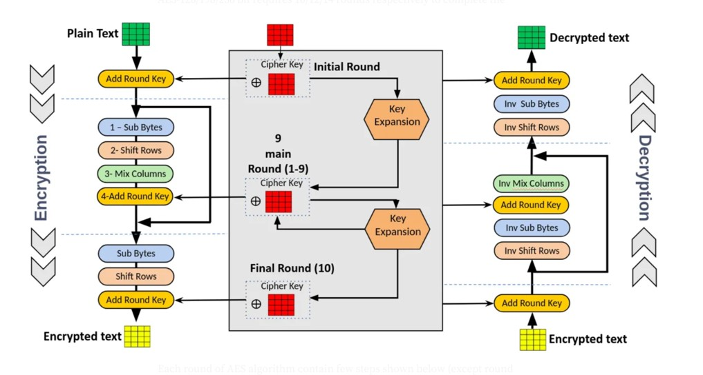
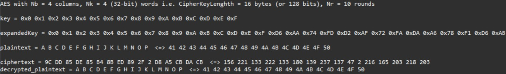
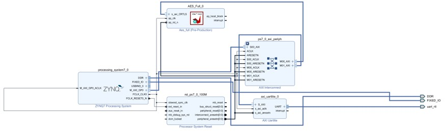
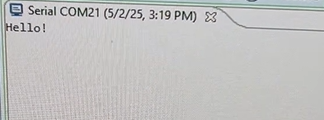
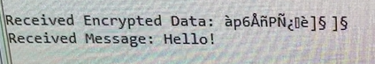

# Encrypted Radio Communication Using FPGAs

## Table of Contents
- [Objective & Motivation](#objective--motivation)  
- [Introduction](#introduction)  
  - [Background](#background)  
  - [AES Encryption Overview](#aes-encryption-overview)  
  - [Serial Communication Flow](#serial-communication-flow)  
- [Implementation Details](#implementation-details)  
  - [Vitis HLS Design](#vitis-hls-design)  
  - [Vivado Block Integration](#vivado-block-integration)  
  - [SoC Implementation](#soc-implementation)  
  - [Software (C Application)](#software-c-application)  
  - [FPGA Hardware Testing](#fpga-hardware-testing)  
- [Actions to be Completed](#actions-to-be-completed)  
- [References](#references)

---

## Objective & Motivation

The goal of this project is to create a secure data transmission system using FPGAs. By combining AES encryption with UART serial communication and HC-12 transceiver modules, we built a functional encrypted radio communication pipeline using the PYNQ-Z1 FPGA board.

This project explores the intersection of hardware cryptography and embedded wireless communication.

### 📡 Hardware Setup

  
*Figure: PYNQ-Z1 connected to HC-12 radio module.*

---

## Introduction

### Background

AES (Advanced Encryption Standard) is a fast and secure symmetric-key encryption algorithm. UART is a widely-used, reliable communication protocol for serial data exchange. Together, they enable secure wireless communication over constrained embedded systems.

We utilized AES for data encryption/decryption and UART for interfacing with the HC-12 radio module. Communication is handled by hardware IP blocks and a custom C application running on the ZYNQ PS.

---

### AES Encryption Overview

AES operates on 128-bit blocks and performs the following sequence:

1. **AddRoundKey** — XOR plaintext with round key  
2. **SubBytes** — Apply S-box substitution  
3. **ShiftRows** — Cyclically shift rows of the state  
4. **MixColumns** — Matrix multiplication in GF(2^8) *(skipped in final round)*  
5. **AddRoundKey** — Apply another round key

This is repeated for a total of 10 rounds for AES-128.

  
*Figure: High-level AES encryption round structure.*

---

### Serial Communication Flow

#### Transmit Pipeline
- User inputs text in PC serial terminal
- Data is buffered (16-byte blocks)
- Each block is encrypted via AES-128 hardware IP
- Transmitted to HC-12 radio module via UART

#### Receive Pipeline
- Encrypted block is received over UART from HC-12
- Decrypted using AES hardware peripheral
- Plaintext is displayed on the terminal

---

## Implementation Details

### Vitis HLS Design

- C implementation of AES verified in HLS
- Exported to custom IP using AXI4-Lite interface
- Hardcoded expanded key from HLS tests
- Included MMIO-ready data input/output registers

  
*Figure: AES logic verification using Vitis HLS.*

---

### Vivado Block Integration

- Integrated AES IP and UARTLite IP into Vivado block design
- Connected to ZYNQ PS via AXI interconnect
- Configured UARTLite TX/RX pins for HC-12 communication
- Ensured proper memory mapping

  
*Figure: Vivado design with ZYNQ PS, AES IP, and UARTLite.*

---

### SoC Implementation

- Exported .xsa hardware definition to Vitis IDE
- Used xparameters.h to determine AES and UART base addresses
- Accessed hardware via MMIO using xil_io.h

---

### Software (C Application)

- Buffered text input from UART terminal
- Performed encryption and transmission via AES IP
- Received encrypted data, performed decryption
- Printed decrypted message to UART terminal

Key headers:
- xil_io.h — MMIO access  
- xparameters.h — Peripheral address mapping  
- xuartlite.h — UART communication functions

---

### FPGA Hardware Testing

- Connected HC-12 radio modules to UARTLite TX/RX
- Verified round-trip encryption and decryption using terminal
- Observed accurate transmission of plaintext to encrypted buffer and back

  
  
*Figure: Verified encrypted UART communication over HC-12 using terminal.*

---

## Actions to be Completed

- [x] Review AES implementation in HLS  
- [x] Export and integrate IP into Vivado  
- [x] Create block design with UART and AXI interconnect  
- [x] Write and test C application  
- [x] Verify encrypted transmission via HC-12  
- [ ] Optimize performance and test larger payloads  
- [ ] Submit GDSII layout for ASIC fabrication (optional)

---

## References

- [Digilent PYNQ-Z1 Manual](https://digilent.com/reference/programmable-logic/pynq-z1/reference-manual)  
- [AMD Vitis HLS Documentation](https://docs.amd.com/r/2024.1-English/ug1399-vitis-hls/pragma-HLS-expression_balance)  
- [UVA HLS/IP Labs Wiki](http://venividiwiki.ee.virginia.edu/mediawiki/index.php/ToolsXilinxLabsRTLHLSAES)  
- [GitHub Repository](https://github.com/hplp/2025-fpga-design-projects-EncryptedRadio)  
- [Xilinx PYNQ GitHub Resources](https://github.com/Xilinx/PYNQ)  
- [AES Calculator](https://testprotect.com/appendix/AEScalc)

---

*Contributors: Alex Clunan, Bobby Downey*